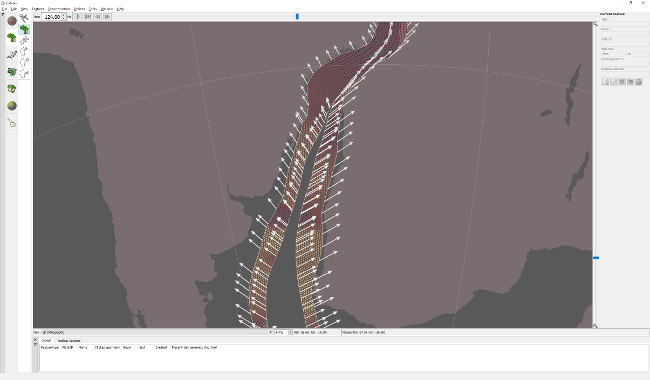

This release contains both GPlates 2.1 and pyGPlates beta revision 18.

Please use this pyGPlates release when working with any data saved by GPlates 2.0 or GPlates 2.1 (especially topologies).
This will avoid incorrect reconstruction of half-stage rotation features (such as mid-ocean ridges) created by GPlates 2.0 (or above).
There are no major new features in this pyGPlates release, it is mostly for compatibility with GPlates 2.0 (and above).
What's new in GPlates 2.1:-

Velocity legend:
Visual indicator of velocity arrow lengths in a target velocity layer.
Displays a single arrow and its velocity (in cm/yr).
Legend velocity can be constant (eg, 2 cm/yr), or variable (to keep arrow length within reasonable limits).
Legend arrow length changes in response to velocity scaling in the target layer.
Projects and recent sessions:
Fixed problems loading projects saved on computers with different locales:
The following backward/forward compatibility rules now apply:
Can load the following on 2.1:
Projects saved with 2.1 on any locale:
For example, (English or Chinese)->(English or Chinese).
Only projects saved with 2.0 on English locale or same locale (if not English):
For example, English->(English or Chinese), or Chinese->Chinese.
Can load the following on 2.0:
Projects saved with 2.1 on any locale, but must be loaded on English locale.
For example, (English or Chinese)->English.
Only projects saved with 2.0 on matching locale.
For example, English->English or Chinese->Chinese.
Save anchored plate ID, background colour and graticule settings to project/session.
When asked to locate a missing data file, show directory where missing file should have been.
Deformation:
Topological networks:
Can now use mid-ocean ridges as boundary/interior sections.
Added triangulation *draw* mode in topology network (brown) layers.
Can draw boundary, mesh or fill (independently of colour mode).
Display mesh by default (instead of boundaries).
Better visual indicator of deforming regions.
Deforming meshes now appear in 2D map views when strain rate smoothing enabled.
Strain rate and accumulated strain:
Added total strain rate.
Visualize and export.
Uses geodesy definition of second invariant in Kreemer et al. 2014.
Added exports for the following accumulated strain quantities:
Strain dilatation.
Principal strain and stretch.
Exports triplet (angle/azimuth, major axis and minor axis).
Major/minor axes are strain (extension positive; compression negative) or stretch (1.0 + strain; always positive).
Plot stretch ellipses in GMT (with psxy).
Added optional strain rate clamping:
Useful for excessively high strain rates in some triangles of deforming mesh.
Clamps *total* strain rate, since includes both normal and shear components.
All strain rate and accumulated strain quantities now calculated in spherical coordinates (instead of 2D cartesian).
Finite strain is now correctly accumulated.
By integrating deformation gradient tensor over time, using spatial gradients of velocity.
Crustal thinning:
Fixed crustal thinning (gamma) factor.
Should be '1 - T/T_initial' instead of 'T/T_initial'.
Automatically convert crustal thinning factors created by GPlates 2.0 (when loading GPML file).
Added crustal stretching (beta) factor 'T_initial/T'.
All three crustal thickness types now created when generating crustal thickness points.
Thickness (kms), stretching (beta) factor and thinning (gamma) factor.
Independently visualize and export.
Can optionally generate points within a lat-lon box.
Calculate statistics using entire history of crustal thicknesses/factors (instead of just at initial time).
Provides a better mapping of palette colours.
Fixed missing IMPORT_AGE attribute in OGR vector formats (eg, Shapefile).
Required for crustal thickness points to work propertly (and half-stage rotations).
Added option to remove points from within a deforming network as soon as they fall outside.
Fixed symbols not working for points when they are reconstructed using topologies.
Rasters:
Enable import and export of NetCDF version 4 rasters (via GDAL library version 2).
Interoperable with GMT version 5.
Optionally compress exported NetCDF.
Support export of *gridline* registered rasters.
Eg, global raster where left and right pixel columns overlap on dateline.
Support greater than 8-bit per channel RGBA rasters (including floating-point).
Import generates transparency for RGBA rasters supporting no-data values (in each R,G,B,A band).
Time-dependent raster (and 3D scalar field) import now supports times (depths) anywhere in filenames.
For ambiguous cases (eg, multiple decimal points) place times (depths) at end of filename (after '_' or '-').
Fixed incorrect half-pixel shift downwards (North to South) for *gridline* registered global GMT grids.
Has been incorrectly shifting since GPlates 1.4.
Fixed semi-transparent vertical seam near North and South poles at longitude 0 or -180.
Happened in 2D map views (and in 3D globe view when reconstructing raster).
Fixed slow rendering of very coarse rasters in 2D map views.
Velocities:
Make GMT velocity export compatible with GMT psxy "-Sv" and "-SV" command-line options.
Angle/azimuth now in column 3 and magnitude in column 4.
Optional plate ID now in column 5.
Colouring:
CPT files:
Support GMT5 "C/M/Y/K" colours and CMYK "COLOR_MODEL".
Support different colour types on a single line (eg, "R/G/B" and "gray80").
Added button to reload CPT file in colouring/draw styles.
Assign *all* known feature types a random colour in Feature Type draw style.
From GPlates 1.3 to 2.0 inclusive, all but 11 feature types were incorrectly assigned the default navy colour.
Digitization:
Fixed vertex edits not modifying topologies.
Eg, moving vertices of a feature used as a topological section in a topological network.
Digitize New Geometries:
No longer offer Reconstruction/Conjugate Plate IDs for topological networks and topological lines.
Only meaningful for topological polygons (eg, to calculate non-deforming plate velocities).
Geometry tests:
Point-in-polygon test now considers points *on* a polygon edge (within extremely small tolerance) to be inside polygon.
Helps ensure points lying exactly on dateline are inside a polygon that has an edge exactly aligned with dateline.
Fixed Assign Plate IDs retaining only first geometry in each feature when using 'copy by overlap'.
Fixed point proximity to a polyline/polygon in rare situations.
Resulted in incorrect selection with Choose Feature tool.
Topology tools:
Build topology tools are now always enabled (makes it easier to build topologies at any time).
GPlates Geological Information Model (GPGIM):
Loosen constraints on properties that can be loaded from a GPML file.
Any feature type can now contain any property defined in the GPGIM.
Can have feature types not defined in GPGIM.
More aligned with current ability to add any property to any feature type (albeit with a warning message).
Also more aligned with Shapefiles (which can load any property, in Shapefile mapping, into any feature type).
Allow multiple 'gpml:boundary' polygons per feature.
Graphics (OpenGL):
Only disable surface mask functionality in 3D scalar fields for problematic graphics driver/hardware.
Only affects surface masking of scalar fields (not all scalar field functionality).
Support up to 10-digit plate IDs (essentially 32-bit signed integers) in all Plate ID spin boxes.
Fixed inability to save PLATES rotation files using non-ASCII (unicode) filenames (in some cases).
Fixed inability to save/load OGR formats (eg, Shapefile) to/from non-ASCII (unicode) filenames.
...and other changes listed in the CHANGELOG file in the GPlates source-code releases.

GPlates 2.1 compiles and runs on Windows 7/8/8.1/10, Linux and MacOS X.

Download GPlates 2.1 from the Download page.

GPlates-compatible data have been made available, and has been updated and extended in many ways for the GPlates 2.1 release. For more information, see the Download page.

PyGPlates enables access to GPlates functionality via the Python programming language. This may be of particular use to researchers requiring more flexibility than is provided by the GPlates user interface.

The pyGPlates binaries currently require Python 2.7, however the pyGPlates source code now works with Python 3. PyGPlates compiles and runs on Windows 7/8/8.1, Linux and MacOS X.

Download pyGPlates beta revision 18 from the Download page.

The pyGPlates documentation and tutorials are available on the User Documentation page and includes:

an introduction to pyGPlates,
an installation guide,
a 'Getting Started' tutorial,
documented sample code,
foundations of pyGPlates, and
a detailed reference of pyGPlates functions and classes.
The pyGPlates tutorials are Jupyter Notebooks that analyse and visualise real-world data using pyGPlates. These tutorials complement the sample code in the pyGPlates documentation by providing a more research-oriented focus.