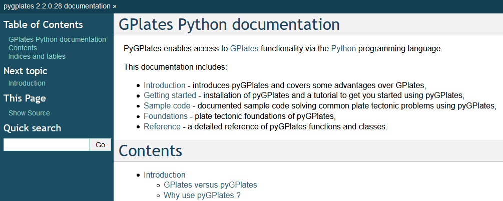

What's new in pyGPlates revision 28:-

* Pre-built pyGPlates libraries for Windows and macOS supporting:
  * Python 2.7
  * Python 3.5
  * Python 3.6
  * Python 3.7
  * Python 3.8
* macOS libraries signed and notarized by Apple:
  * Should no longer get security prompts (including macOS Catalina).
*  Ubuntu packages for 16.04 LTS (Xenial), 18.04 LTS (Bionic), 19.10 (Eoan) and 20.04 LTS (Focal).
  * Python 2 and 3 (32-bit and 64-bit), except Focal (Python 3 64-bit only).
* Create topological features (dynamic lines, polygons and deforming networks):
  * Usually they are built in GPlates, but this can now be done in pyGPlates.
  * See the sample code.
* Supports deforming trenches when used with subduction convergence script.
* Much faster querying of reconstructions.
* Bug fixes.

Download this release from the Download page.

The pyGPlates documentation and tutorials are available on the User Documentation page and includes:

* an introduction to pyGPlates,
* an installation guide,
* a 'Getting Started' tutorial,
* documented sample code,
* foundations of pyGPlates, and
* a detailed reference of pyGPlates functions and classes.

The pyGPlates tutorials are Jupyter Notebooks that analyse and visualise real-world data using pyGPlates. These tutorials complement the sample code in the pyGPlates documentation by providing a more research-oriented focus.

PyGPlates enables access to GPlates functionality via the Python programming language. This may be of particular use to researchers requiring more flexibility than is provided by the GPlates user interface.

PyGPlates compiles and runs on Windows 10, macOS 10.13+ and Linux.
